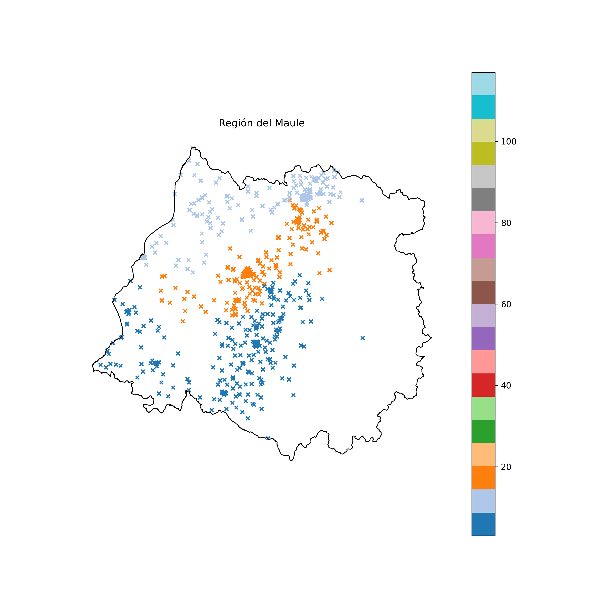
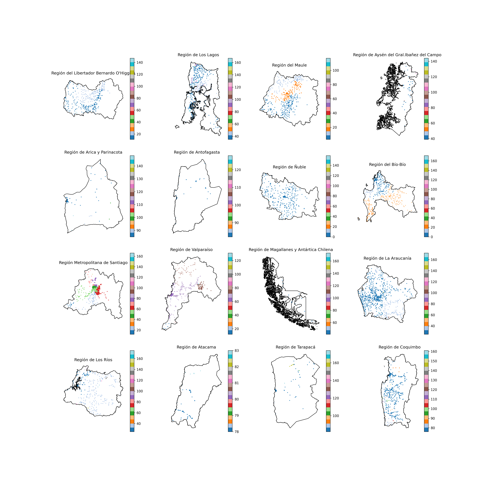

# Asignación de UT's en licitación
## Junaeb-IMT-Capstone
Datos e implementaciones para resolver el problema de asignación de UTs para la Junaeb

### Ejecutable
El archivo que se debe ejecutar para hacer funcionar el modelo creado es ```junaeb_UT_creator.py```, ubicado en el directorio principal. Para estos efectos, se ejecutará en la consola ```python junaeb_UT_creator.py```. Ahora, se pasará a detallar cada uno de los pasos del ejecutable.

Es importante notar que el paso que demora más tiempo es el TSP solver, o sea, la estimación de los costos logísticos. Para aquello, se debe setear los booleanos ```SAVE_LOGISTICS``` y ```USE_LOGISTICS```, de forma de optimizar el tiempo de ejecución del archivo. La primera variable, indica si se va a guardar los costos logísticos calculados en esa ejecución del código, de forma de poder usarlos después. La segunda variable, indica si se usarán los costos logísticos ya prevgiamente calculados, o se calcularán nuevamente. La idea de estas variables es que en la primera ejecución se calculen los costos y se guarden, para en las próximas ocasiones sólo usar los ya guardados.

### Requerimientos
Para asegurar el correcto funcionamiento del algoritmo, hay que tener instalado ````c++```` y ````python>=3.6````. Para el primero, hay que además tener disponible un compilador.

Además, se deben cumplir los requerimientos de librerías instaladas, las que incluyen:
* geopandas==0.14.0
* matplotlib==3.8.0
* networkx==3.1
* numpy==1.26.0
* pandas==2.1.1
* tqdm==4.66.1
* statsmodels==0.14.1

Para estos efectos, se puede verificar el cumplimiento de estas con ```check_import_requirements()``` ubicada en ```modules/requirements.py```
En el caso de no cumplir los requerimientos de librerías, se puede ejecutar el comando ```pip install -r requirements.txt'```

### Datos
Se hace uso de los dos datasets:
1. ```Copia de PAE_2019.XLSX```: Contiene todos los datos de la licitación del año 2019, incluyendo datos relevantes como cada colegio (RBD) con distintos programas que incluyen el precio unitario licitado, cantidad de raciones, el precio total, empresa adjudicada, entre otros. Este dataset contiene datos de distintos programas de alimentación, entre los que se encuentra JUNAEB. Este dataset no se incluye en el repositorio debido a su peso. El archivo debiese estar incluído en ```./Data/```
2. ```Colegios2020.xlsx```: Contiene los datos de cada colegio en territorio nacional incluyendo su latitud, longitud y dirección. El archivo debiese estar incluído en ```./Data/```
3. ```Regional.shp```: Contiene los datos vectoriales de cada una de las regiones en Chile. El archivo debiese estar incluído en ```./Data/Regiones/```
   
Para estos efectos, se puede verificar el cumplimiento de estas con ```check_data_requirements()``` ubicada en ```modules/requirements.py```

### Manejo de datos
Para manejar los datos, se realizan los siguientes procesos en orden:
1. ```get_coords_osm()``` y ```get_coords_google()```: Obtener las coordenadas de colegios que <añadir restricción> a partir de la dirección indicada en el dataset ```Colegios2020.xlsx```. Ubicada en ```modules/geo.py```
2. ```join_duplicate_schools()```: Hace un merge entre los colegios que están en la misma ubicación, considerándolos uno solo. Ahora cada fila tiene una lista de RBD's. Ubicada en ```modules/db_management.py```
3. ```get_closest_dijkstra()```: Obtener una los ````k```` (25 en nuestro caso) vecinos más cercanos, dado un radio máximo dado como input. Ubicada en ```modules/find_neighs.py```. Para esto, se usa ```convert_to_degrees``` y ```convert_to_meters```. Ubicada en ```modules/geo.py```. ```nearest_points()```, ````get_closest()```` y ```get_closest_intersect``` hacen lo mismo con otros métodos. Ubicados en ```geo.py``` y ````find_neighs.py````.
4. ```add_food_rations_and_costs```: Añade al dataset cada una de las columnas, ```manipuladora```, ```beneficio```, ```Alimentos```, ```Raciones```. Estas columnas representan costo de manipuladoras, lo que se le paga a cada empresa según los datos, lo que cuesta los alimentos y la cantidad de raciones; respectivamente. Ubicado en ```modules/db_management.py```.
5. ```add_profit()```: Añade al dataset la columna profit. Esta columna representa la ganancia de la empresa. Ubicado en ```modules/db_management.py```.

### Estimación de costos de Escala
Para estimar los costos de escala se calculó la recta de mínimos cuadrados ponderados que mejor ajustaba a los datos, esto con los módulos en ```preprocess_scale.py```. Ubicado en ```modules```. Finalmente, dada la baja significancia de la recta obtenida y el valor de la pendiente obtenida, desde este punto se usa el primer parámetro como precio constante, eliminando las economías de escala del modelamiento

### Estimación de costos logísticos
Para reducir la complejidad del problema, se hace una estimación de los costos logísticos por colegio cada mes. Esto se modeló en la clase ```TSPApprox```, ubicada en ```modules/tsp.py```. 

La clase recibe parámetros fijos que usa para la aproximación, estos se encuentran en ```modules/parameters.py``` y desde ahora, se notarán como ```p.ATRIBUTO```

El algoritmo, implementado en el método ```solve()```, calcula un estimado para cada colegio calculando el promedio de ```p.MAX_SAMPLES``` TSP's, haciendo un sampling de los ````k```` colegios más cercanos. Las muestras se hacen tomando una distribución dada por las distancias inversas respecto al camino obtenido mediante Dijkstra, con el método ```get_options_dijkstra()```.

Vale recalcar, cada TSP se resuelve mediante ```tsp_run()```, que a su vez hace un llamado al compilado, cuya dirección se encuentra en ```p.RUN_COMMAND```. El compilado proviene de un archivo cuya dirección se encuentra en ```p.COMP_COMMAND```.

El resultado del cálculo de cada TSP muestreado, hecho en ```tsp_sample()```, está dado, en una primera parte, por el costo fijo del vehículo ```p.VEHICLE_COST```. A lo anterior, se le suma el costo del TSP por un valor de conversión de distancia a pesos ```p.CONV_FACTOR```.

### Asignación de Unidades Territoriales
La asignación de unidades territoriales resuelve con la clase en ```UTSolver``` en ```modules/ut_solver.py```, usando la estimación de costos logísticos

Primeramente, se calcula un Minimum Spanning Tree, con la función ```MST()```, que retorna una lista de aristas. Esto se hace de manera que cada corte en el grafo genere dos árboles. Además, para manejar el grafo, se utilizan además dos funciones, ```get_adj_list()``` y ```get_edges()```. La primera, obtiene una lista de adyacencia de un grafo completo, a partir de puntos. La segunda, a partir de la lista de adyacencia, obtiene todas las aristas del grafo. Funciones ubicadas en ```modules/graph.py```.

Posteriormente, se utiliza una estrategia divide and conquer, iniciando todo Chile con una unidad territorial, para después ir dividiéndolo hasta que cada subárbol (UT) generado cumpla que tenga una cantidad de raciones menor a ```p.MAXR```. Además, existe la restricción de que cada subárbol generado, debe tener una cantidad de raciones mayor a ```p.MINR```. En el camino, se va asignando cada UT a su nodo correspondiente del árbol mediante la función ```assign_ut_to_nodes()```. Ubicada en ```modules/graph.py``` y como método de ```UTSolver```

La manera en la que se encuentra la mejor arista de corte es buscando extensivamente la mejor arista que cumpla con ```p.A```*```ratio_val``` + ```p.B```*```ratio_compacity```, donde ````ratio_compacity```` es la compacidad y  ```ratio_val``` indica cuántas veces más grande es la UT más grande creada por el corte versus la más pequeña (en términos de ganancia esperada). Además, ```p.A``` es la constante de regularización de la razón de profit y ```p.B``` es la constante de regularización de la compacidad. La búsqueda extensiva en cada paso se hace mediante la función ```find_best_split()```. Ubicada en```modules/graph.py``` y también como método de ```UTSolver```.

El cálculo de la compacidad se realiza obteniendo la suma de dos ratios. El primero, se calcula mediante la razón entre el mayor y menor lado del rectángulo envolvente de la UT correspondiente a debajo del corte realizado. El segundo, se calcula mediante el menor rectángulo envolvente de la UT creada arriba del corte realizado.

Por otro lado, el calculo del valor de ```ratio_val```, se hace mediante la función ```get_subtree_metrics()```, que calcula para cierto nodo y árbol, su profit, número de raciones y máximo y mínimo espacial de la UT creada. Ubicada en```modules/graph.py``` y también como método de ```UTSolver```.


### Plot de resultados
Cuando ya se tienen los resultados de las UT's asignadas, se procede a visualizar los resultados, esto con ayuda de la librería ```matplotlib.pyplot```. Lo anterior, con funciones que se encuentran en ```pretty_plot.py```, que las guarda en el directorio ```plots```.
En primer lugar, con la función ```single_plot_uts``` se guarda la visualización de cada región por separado, en un archivo llamado ```UTs_R{n_region}.png```. El resultado, tiene el formato de a continuación:

Por último, con la función ```total_plot_uts``` se guarda la visualización de todas las regiones juntas, en subplots separados en un archivo llamado ```UTs.png```. El resultado, tiene el formato de a continuación:


### Resultados
Se puede obtener los resultados de los colegios asignados a cada ut mediante ```ut_assignation()```, ubicada en ```modules/db_management.py```. Esta función recibe el dataset solución de ```UTSolver``` y retorna un dataset separado por colegio, como estaba en un principio, antes de aplicar ```join_duplicate_schools()```. En otras palabras, esto hace la función inversa

### Comparación de soluciones
En el archivo ```stats.ipynb``` se comparan las estadísticas de las soluciones entre 2019 y hoy. El profit correspondiente a cada UT en la solución antigua se obtiene mediante la función ```get_ut_profits()```, ubicada en ```modules/db_management.py```. Posteriormente, mediante los profits correspondientes, se obtienen las estadísticas del promedio, máximo y mínimo de diferencia cada UT. Para este cálculo, se usa la función ```obtain_stats()```, ubicada en ```modules/db_management.py```.