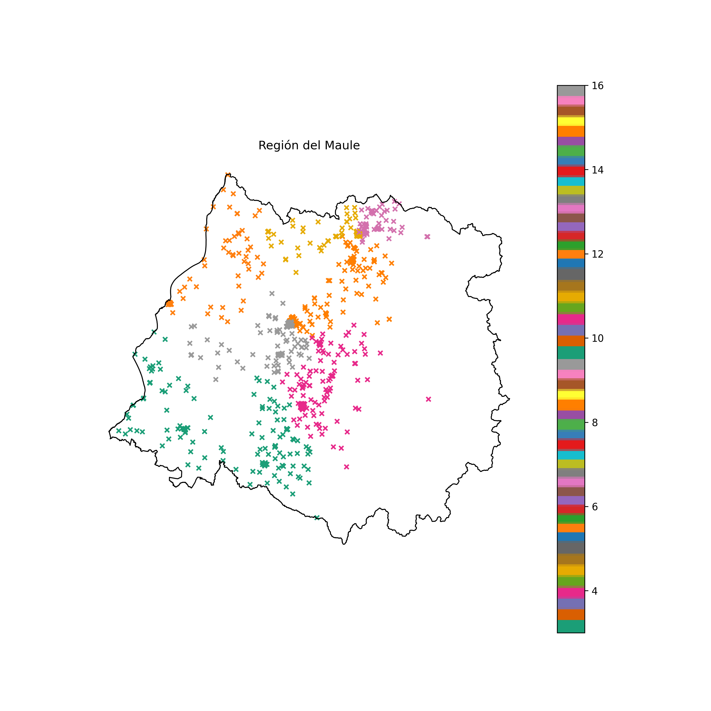
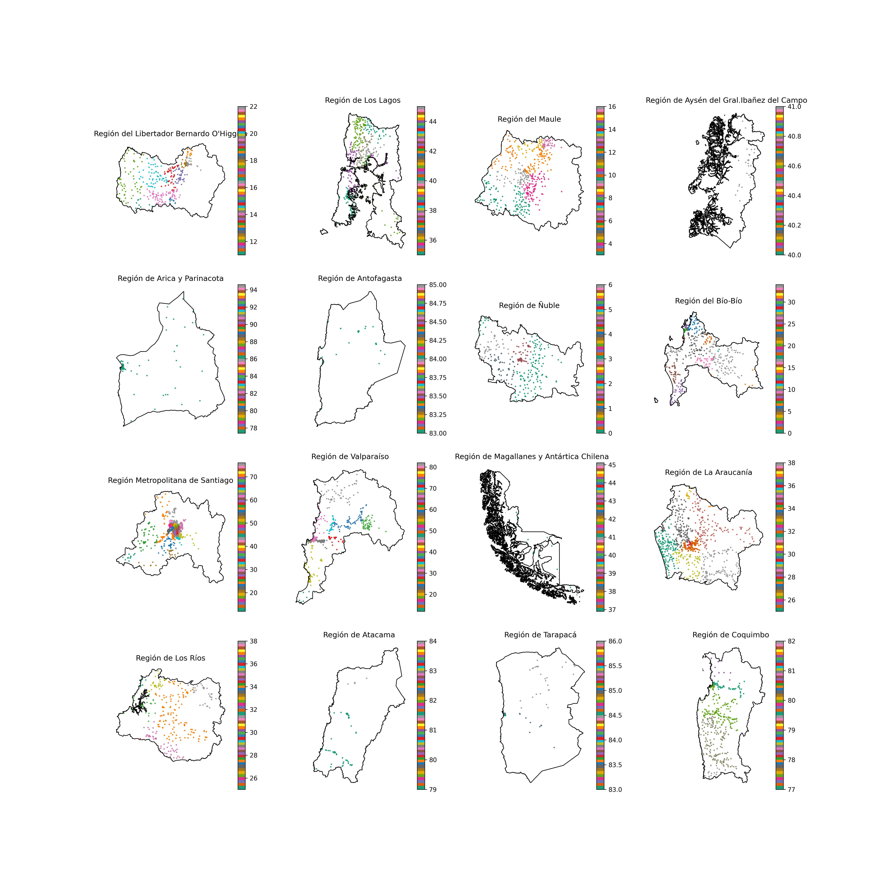

# Asignación de UT's en licitación
## Junaeb-IMT-Capstone
Datos e implementaciones para resolver el problema de asignación de UTs para la Junaeb

### Requerimientos
Para asegurar el correcto funcionamiento del algoritmo, se deben cumplir los requerimientos de librerías instaladas, las que incluyen:
* geopandas==0.14.0
* matplotlib==3.8.0
* networkx==3.1
* numpy==1.26.0
* pandas==2.1.1
* tqdm==4.66.1
Para estos efectos, se puede verificar el cumplimiento de estas con ```check_import_requirements()``` ubicada en ```modules/requirements.py```
En el caso de no cumplir los requerimientos, se puede ejecutar el comando ```pip install -r requirements.txt'```

### Datos
Se hace uso de los dos datasets:
1. ```Copia de PAE_2019.XLSX```: Contiene todos los datos de la licitación del año 2019, incluyendo datos relevantes como cada colegio (RBD) con distintos programas que incluyen el precio unitario licitado, cantidad de raciones, el precio total, empresa adjudicada, entre otros. Este dataset contiene datos de distintos programas de alimentación, entre los que se encuentra JUNAEB. Este dataset no se incluye en el repositorio debido a su peso. El archivo debiese estar incluído en ```./Data/```
2. ```Colegios2020.xlsx```: Contiene los datos de cada colegio en territorio nacional incluyendo su latitud, longitud y dirección. El archivo debiese estar incluído en ```./Data/```
3. ```Regional.shp```: Contiene los datos vectoriales de cada una de las regiones en Chile. El archivo debiese estar incluído en ```./Data/Regiones/```
   
Para estos efectos, se puede verificar el cumplimiento de estas con ```check_data_requirements()``` ubicada en ```modules/requirements.py```

### Manejo de datos
Para manejar los datos, se realizan los siguientes procesos en orden:
1. ```get_coords_osm()``` y ```get_coords_google()```: Obtener las coordenadas de colegios que <añadir restricción> a partir de la dirección indicada en el dataset ```Colegios2020.xlsx```. Ubicada en ```modules/geo.py```
2. ```join_duplicate_schools()```: Hace un merge entre los colegios que están en la misma ubicación, considerándolos uno solo. Ahora cada fila tiene una lista de RBD's. Ubicada en ```modules/db_management.py```
3. ```nearest_points()```: Obtener una los ````k```` (28 en nuestro caso) vecinos más cercanos, dado un radio máximo dado como input. Para esto, se usa ```convert_to_degrees``` y ```convert_to_meters```. Ubicada en ```modules/geo.py```
4. ```get_closest_dijkstra()```: Obtener una los ````k```` (**30 en nuestro caso**) vecinos más cercanos. Ubicada en ```modules/find_neighs.py```. Duplicada
5. **Filtración de columnas y borrar nuls**
6. **Creo que deberíamos colocar lo que se hizo con el dataset 2019 en vez de los anteriores**

### Cálculo de costos de Escala
**Faltante**

### Estimación de costos logísticos
Para reducir la complejidad del problema, se hace una estimación de los costos logísticos por colegio cada mes. Esto se modeló en la clase ```TSPApprox```, ubicada en ```modules/tsp.py```. 

La clase recibe parámetros fijos que usa para la aproximación, estos se encuentran en ```modules/parameters.py``` y desde ahora, se notarán como ```p.ATRIBUTO```

El algoritmo, implementado en el método ```solve()```, calcula un estimado para cada colegio calculando el promedio de ```p.MAX_SAMPLES``` TSP's, haciendo un sampling de los ````k```` colegios más cercanos. Las muestras se hacen tomando una distribución dada por las distancias inversas **respecto al camino obtenido mediante dijkstra**, con el método ```get_options_dijkstra()```.

Vale recalcar, cada TSP se resuelve mediante ```tsp_run()```, que a su vez hace un llamado al compilado, cuya dirección se encuentra en ```p.RUN_COMMAND```. El compilado proviene de un archivo cuya dirección se encuentra en ```p.COMP_COMMAND```.

El resultado del cálculo de cada TSP muestreado, hecho en ```tsp_sample()```, está dado, en una primera parte, por el costo fijo del vehículo ```p.VEHICLE_COST```. A lo anterior, se le suma el costo del TSP por un valor de conversión de distancia a pesos ```p.CONV_FACTOR```.

### Asignación de Unidades Territoriales
La asignación de unidades territoriales resuelve con la clase en ```UTSolver``` en ```modules/ut_solver.py```, usando la estimación de costos logísticos

Primeramente, se calcula un Minimum Spanning Tree, con la función ```MST()```, que retorna una lista de aristas. Esto se hace de manera que cada corte en el grafo genere dos árboles, ubicada en ```modules/graph.py```. 

Posteriormente, se utiliza una estrategia divide and conquer, iniciando todo Chile con una unidad territorial, para después ir dividiéndolo hasta que cada subárbol (UT) generado cumpla que tenga una cantidad de raciones menor a ```p.MAXR```. Además, existe la restricción de que cada subárbol generado, debe tener una cantidad de raciones mayor a ```p.MINR```.

La manera en la que se encuentra la mejor arista de corte es buscando extensivamente la mejor arista que cumpla con ```p.A```*```ratio_val``` + ```p.B```*```ratio_compacity```, donde ````ratio_compacity```` es la compacidad y  ```ratio_val``` indica cuántas veces más grande es la UT más grande creada por el corte versus la más pequeña (en términos de ganancia esperada). Además, ```p.A``` es la constante de regularización de la razón de profit y ```p.B``` es la constante de regularización de la compacidad.

El cálculo de la compacidad se realiza obteniendo la suma de dos ratios. El primero, se calcula mediante la razón entre el mayor y menor lado del rectángulo envolvente del punto . El segundo, se calcula mediante el menor rectángulo envolvente de la UT creada y sus vecinos.


### Plot de resultados
Cuando ya se tienen los resultados de las UT's asignadas, se procede a visualizar los resultados, esto con ayuda de la librería ```matplotlib.pyplot```. Lo anterior, con funciones que se encuentran en ```pretty_plot.py```, que las guarda en el directorio ```plots```.
En primer lugar, con la función ```single_plot_uts``` se guarda la visualización de cada región por separado, en un archivo llamado ```UTs_R{n_region}.png```. El resultado, tiene el formato de a continuación:

Por último, con la función ```total_plot_uts``` se guarda la visualización de todas las regiones juntas, en subplots separados en un archivo llamado ```UTs.png```. El resultado, tiene el formato de a continuación:


### Cosas no agregadas
1. add_food_rations_and_costs() en db_management.py
2. add_profit() en db_management.py
3. ut_assignation() en db_management.py
4. save_data() en db_management.py
5. get_closest() en find_neighs.py
6. get_closest_dijkstra() en find_neighs.py
7. get_closest_intersect() en find_neighs.py
8. nearest_points() en geo.py
9. find() en graph.py
10. union() en graph.py
11. get_adj_list() en graph.py
12. get_edges() en graph.py
13. distance() en graph.py
14. plot_graph() en graph.py
15. get_subtree_metrics() en graph.py
16. find_best_split() en graph.py (Duplicado de UT solver)
17. assign_ut_to_nodes() en graph.py
18. Parameters.py
19. class UTSolver en ut_solver.py

### Cosas que no se usan
1. p.MAXSZ
